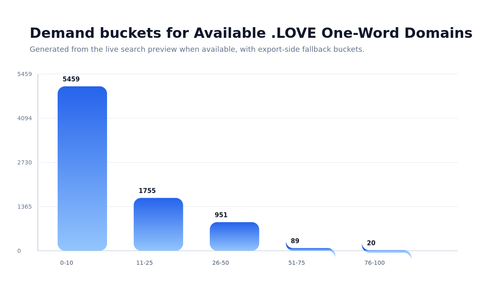

# Available .LOVE One-Word Domains (5,622,446)

<p align="left">
  
  
  
  
  
  
</p>

Daily-updated public extract of available and resale .love one-word domains from Unique Domains.

> **Important:** this repository is a **public 8,275-row extract**, not the full live catalog.
> The full live catalog for this exact search currently contains **5,622,446 domains** on the canonical page below.

**Last updated:** 2026-04-09  
**Canonical page:** `https://unique.domains/domains/tld/love`  
**Best for:** founders, investors, studios

---

<p align="center">
  <a href="https://unique.domains/domains/tld/love?utm_source=github&utm_medium=referral&utm_campaign=repo_love_oneword_domains&utm_content=top_open_search"><b>Open live .LOVE search</b></a> ·
  <a href="https://unique.domains/domains/tld/love?github_intent=radar&utm_source=github&utm_medium=referral&utm_campaign=repo_love_oneword_domains&utm_content=top_create_radar"><b>Create .LOVE Radar</b></a> ·
  <a href="https://unique.domains/domains/tld/love?github_intent=project&utm_source=github&utm_medium=referral&utm_campaign=repo_love_oneword_domains&utm_content=top_start_project"><b>Start a naming Project</b></a> ·
  <a href="./love.csv"><b>Download CSV</b></a> ·
  <a href="./love.json"><b>Download JSON</b></a> ·
  <a href="https://unique.domains/technology?utm_source=github&utm_medium=referral&utm_campaign=repo_love_oneword_domains&utm_content=top_methodology"><b>Methodology</b></a> ·
  <a href="https://unique.domains/api?utm_source=github&utm_medium=referral&utm_campaign=repo_love_oneword_domains&utm_content=top_api_docs"><b>API docs</b></a>
</p>

## 📦 What this repository contains

This repository is the public extract for Unique Domains' .LOVE one-word domain catalog.

### Files

- `love.csv` — public CSV extract (8,275 rows)
- `love.json` — public JSON extract (8,275 rows)
- `DATA_DICTIONARY.md` — field definitions for the exported files
- `METHODOLOGY.md` — scope, refresh policy, and caveats
- `CHANGELOG.md` — latest snapshot metadata
- `CITATION.cff` — machine-readable dataset citation metadata
- `LICENSE` — terms for the public extract
- `assets/chart-demand-buckets.png` — generated demand-buckets chart

### Use this repo to

- inspect a public sample
- download CSV or JSON
- cite the dataset
- understand the fields and scoring inputs

### Use the live page to

- keep the exact search context
- search the full .LOVE catalog
- filter by price, demand, status, spelling risk, and fit
- save the exact search as a Radar
- turn the search into a founder Project

## 📊 Snapshot of the live .LOVE catalog



**Why this chart:** it gives a fast overview of the live search composition using the same preview payload that supplies the README counts.

## 🧭 Quick start

```python
import pandas as pd

df = pd.read_csv("https://raw.githubusercontent.com/UniqueDomains/love-oneword-domains/main/love.csv")
print(df.head())
```

## 🗂️ Sample rows

| domain          | status    | purchase_price | renewal_price | attractiveness | demand | length | registrar                                          |
| --------------- | --------- | -------------- | ------------- | -------------- | ------ | ------ | -------------------------------------------------- |
| adobe.love      | available | $38.98         | —             | 72             | 70     | 5      | namecheap                                          |
| academic.love   | resell    | $31.98         | —             | 96             | 22     | 8      | Chengdu West Dimension Digital Technology Co., LTD |
| converse.love   | premium   | $3,640         | $5,200        | 64             | 73     | 8      | namecheap                                          |
| nationwide.love | available | $38.98         | —             | 76             | 66     | 10     | namecheap                                          |
| sovereign.love  | resell    | —              | —             | 86             | 98     | 9      | Dynadot, LLC                                       |
| sense.love      | premium   | $227.50        | $325          | 84             | 64     | 5      | namecheap                                          |
| artistry.love   | available | $38.98         | —             | 82             | 63     | 8      | namecheap                                          |
| fierce.love     | resell    | —              | —             | 80             | 98     | 6      | GoDaddy                                            |
| cloud.love      | premium   | $520           | $1,040        | 70             | 59     | 5      | namecheap                                          |
| stark.love      | available | $38.98         | —             | 72             | 45     | 5      | namecheap                                          |
| autonomous.love | resell    | —              | —             | 76             | 98     | 10     | GMO Internet, Inc. d/b/a Onamae.com                |
| ace.love        | premium   | $5,460         | $7,800        | 88             | 57     | 3      | namecheap                                          |
| trace.love      | available | $38.98         | —             | 64             | 35     | 5      | namecheap                                          |
| parody.love     | resell    | —              | —             | 92             | 97     | 6      | GMO Internet, Inc. d/b/a Onamae.com                |
| live.love       | premium   | $5,460         | $7,800        | 108            | 55     | 4      | namecheap                                          |
| checkin.love    | available | $38.98         | —             | 72             | 28     | 8      | namecheap                                          |
| peacock.love    | resell    | —              | —             | 68             | 81     | 7      | GMO Internet, Inc. d/b/a Onamae.com                |
| business.love   | premium   | $2,600         | $5,200        | 100            | 54     | 8      | namecheap                                          |
| adept.love      | available | $38.98         | —             | 92             | 27     | 5      | namecheap                                          |
| standard.love   | resell    | —              | —             | 66             | 70     | 8      | Porkbun LLC                                        |

## 🧱 Field summary

- `domain` — Fully qualified domain name.
- `status` — Current acquisition state for the domain in the public extract.
- `purchase_price` — Visible purchase price when available.
- `renewal_price` — Visible renewal price when available.
- `attractiveness` — Composite naming score used as a decision-support signal.
- `demand` — Relative buyer-pressure score when available.
- `length` — Character count without the TLD.
- `registrar` — Registrar name when known.
- `created_at` — Creation timestamp when known.
- `expires_at` — Expiry timestamp when known.

See [DATA_DICTIONARY.md](./DATA_DICTIONARY.md) for full definitions and types.

## ⚠️ Methodology and caveats

This repository follows the exact public search represented by the canonical page above.

- This repository is a public extract, not the full live catalog.
- Counts, prices, and statuses can change over time.
- Scores are decision-support signals, not guarantees of resale value.
- Trademark, SEO, and risk signals should be treated as screening inputs, not legal or specialist advice.
- The live product contains deeper filters, monitoring, and decision workflows than this public extract.

See [METHODOLOGY.md](./METHODOLOGY.md) for the full methodology reference.

## 🔄 Update policy

- This repository is refreshed regularly from the same export pipeline used for public dataset repos.
- The README count targets the live catalog count from the public landing response when available.
- The CSV and JSON files contain the public extract only and may not match the full live catalog size.
- Stable historical references should be published via GitHub Releases outside this repository snapshot.

See [CHANGELOG.md](./CHANGELOG.md) for the latest snapshot metadata.

## 📝 How to cite

Suggested citation:

> Unique Domains. *Available .LOVE One-Word Domains*. Version 2026-04-09. Public GitHub extract for the exact Unique Domains search represented by this repository.

GitHub citation metadata is available in [CITATION.cff](./CITATION.cff).


## 🔗 Related links

- [Live .LOVE page](https://unique.domains/domains/tld/love?utm_source=github&utm_medium=referral&utm_campaign=repo_love_oneword_domains&utm_content=top_open_search)
- [Technology and scoring](https://unique.domains/technology?utm_source=github&utm_medium=referral&utm_campaign=repo_love_oneword_domains&utm_content=top_methodology)
- [Pricing](https://unique.domains/pricing?utm_source=github&utm_medium=referral&utm_campaign=repo_love_oneword_domains&utm_content=related_pricing)
- [Main catalog repo](https://github.com/UniqueDomains/oneword-domains)

## 📬 Contact

Questions, corrections, or partnership requests: `hello@unique.domains`
